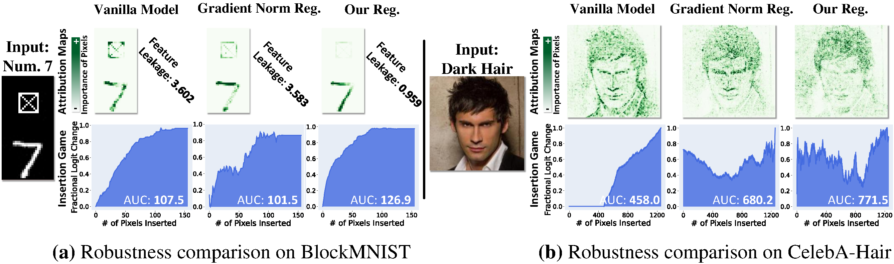

# Regulating Model Reliance on Non-Robust Features by Smoothing Input Marginal Density (ECCV 2024)

This code implements an input marginal density regulariation from the following paper:

> Peiyu Yang, Naveed Akhtar, Mubarak Shah, and Ajmal Mian
>
> [Regulating Model Reliance on Non-Robust Features by Smoothing Input Marginal Density](https://arxiv.org/abs/2407.04370)


## Introduction
Trustworthy machine learning necessitates meticulous regulation of model reliance on non-robust features. We propose a framework to regulate such features by attributing model predictions to the input. Within our approach, we identify a correlation between model reliance on non-robust features and smoothness of marginal density of the input samples. Hence, we uniquely regularize the gradients of the marginal density w.r.t.~the input features for robustness. We also devise an efficient implementation of our regularization to address the potential numerical instability of the underlying optimization process.


## Prerequisites

- python 3.9.2
- matplotlib 3.5.1
- numpy 1.21.5
- pytorch 1.12.0
- torchvision 0.13.1
- tqdm 4.64.0


## Re-calibrating attributions

### Step 1: Preparing dataset.
```
dataset\DATASET
```

### Step 2: Preparing models.
```
pretrained_models\YOUR_MODEL
```

### Step 3: Re-calibrating attributions (*IG Uniform*).

```
python main.py
```

## Quantitatively evaluations
```
python main.py 
```

## Bibtex
If you found this work helpful for your research, please cite the following papers:
```
@artical{yang2024regulating,
    title={Regulating Model Reliance on Non-Robust Features by Smoothing Input Marginal Density},
    author={Peiyu, Yang and Naveed, Akhtar and Mubarak, Shah and Ajmal, Mian},
    booktitle={European Conference on Computer Vision {ECCV}},
    year={2024}
}
```
